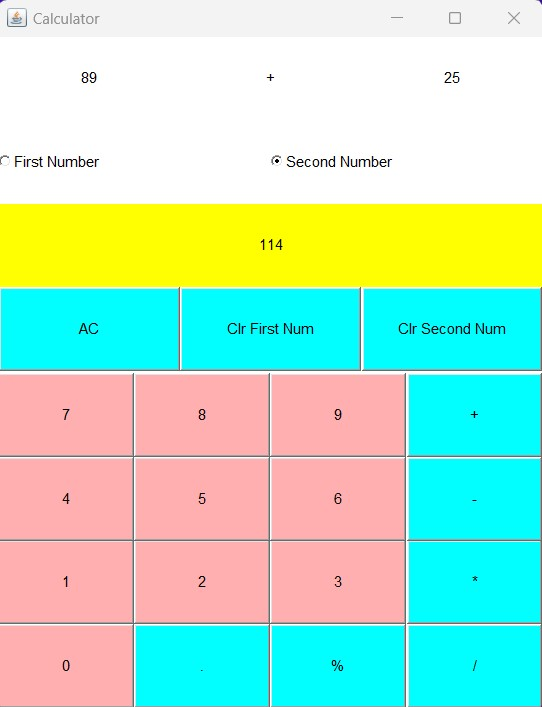

# Calculator

***Java AWT Project***

A Simple Calculator with basic Operations

## Getting started

>  The following calculator uses different Classes and Objects of AWT to perform simple operations

### Thanks for Visting here

Follow me on LinkedIn : https://www.github.com/hackbysarthak03

